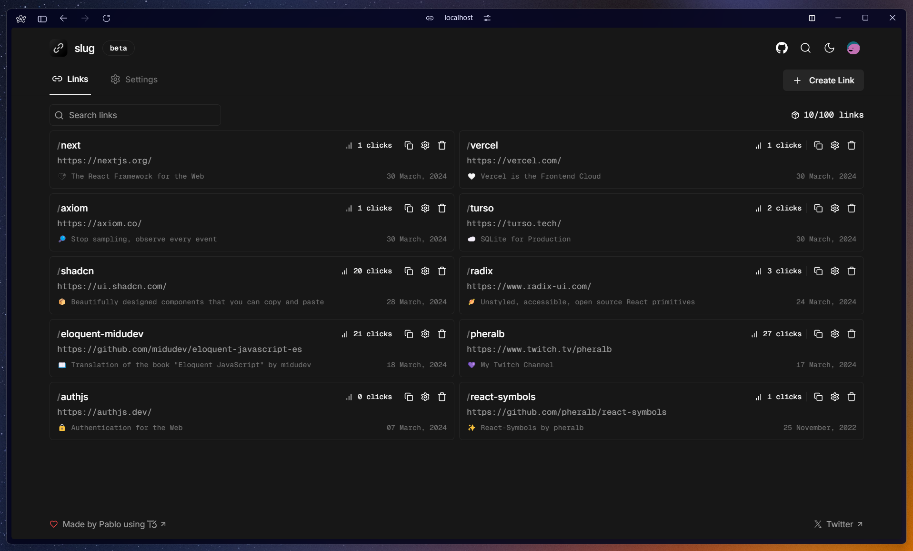

  
  

  

    <b>
      Routaar – Central control tower for branded subdomains and smart redirects.
    </b>
  

<a href="https://rout.aars.works/dashboard">Dashboard</a>
&nbsp;&nbsp;❖&nbsp;&nbsp;
<a href="#">Docs</a>
&nbsp;&nbsp;❖&nbsp;&nbsp;
<a href="https://github.com/UserAAR">GitHub</a>
&nbsp;&nbsp;❖&nbsp;&nbsp;
<a href="https://links.aars.works">Social Links</a>

## 👨‍🚀 Introduction

Routaar is a platform to manage branded subdomains and smart redirects from a single control panel. Create redirect or render rules, forward path/query, and keep your domain as the single entry point for your content.

This project uses the following technologies:

- Next.js 14 App Router
- Prisma + Turso (libSQL)
- Auth.js (NextAuth)
- Tailwind + Radix UI
